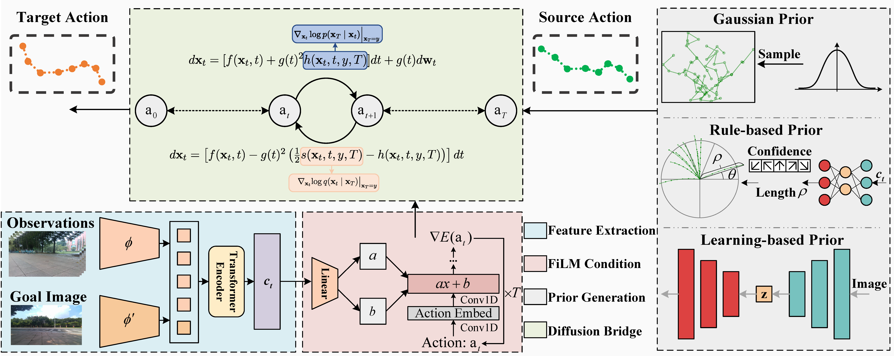

# Prior Does Matter: Visual Navigation via Denoising Diffusion Bridge Models (NaviBridger)

> 🏆 Accepted at **CVPR 2025**  
> 🔗 [Github](https://github.com/hren20/NaiviBridger) | [arXiv](https://arxiv.org/abs/2504.10041)

<p align="center">
  
</p>

---

## 📌 TLDR

NaviBridger is a novel framework for visual navigation built upon **Denoising Diffusion Bridge Models (DDBMs)**. Unlike traditional diffusion policies that start from Gaussian noise, NaviBridger leverages **prior actions** (rule-based or learned) to guide the denoising process, accelerating convergence and improving trajectory accuracy.

---

## 🛠️ Key Features
- 🔧 DDBM-based policy generation from arbitrary priors  
- 🔁 Unified framework supporting Gaussian, rule-based, and learning-based priors  
- 🏃‍♂️ Real-world deployment support on mobile robots (e.g., Diablo + Jetson Orin AGX)

---

## ✅ TODO List

- [ ] Deployment code updates
- [ ] A refactored version of the code (in the coming weeks)

---

## 📁 Directory Overview

```
navibridge/
├── train/                           # Training code and dataset processing
│   ├── vint_train/                 # NaviBridger models, configs, and datasets
│   ├── train.py                   # Training entry point
│   ├── process_*.py              # Data preprocessing scripts
│   └── train_environment.yml     # Conda setup for training
├── deployment/                     # Inference and deployment
│   ├── src/navibridger_inference.py
│   ├── config/params.yaml        # Inference config
│   ├── deployment_environment.yaml
│   └── model_weights/            # Place for .pth model weights
└── README.md                      # This file
```

---

## ⚙️ Setup

### 🧪 Environment (Training)

```bash
conda env create -f train/train_environment.yml
conda activate navibridge_train
pip install -e train/
git clone git@github.com:real-stanford/diffusion_policy.git
pip install -e diffusion_policy/
```

### 💻 Environment (Deployment)

```bash
conda env create -f deployment/deployment_environment.yaml
conda activate navibridge
pip install -e train/
pip install -e diffusion_policy/
```

---

## 📦 Data Preparation

1. Download public datasets:
   - [RECON](https://sites.google.com/view/recon-robot/dataset)
   - [SCAND](https://www.cs.utexas.edu/~xiao/SCAND/)
   - [GoStanford2](https://cvgl.stanford.edu/gonet/dataset/)
   - [SACSoN](https://sites.google.com/view/sacson-review/huron-dataset)

2. Process datasets:
   ```bash
   python train/process_recon.py  # or process_bags.py
   python train/data_split.py --dataset <your_dataset_path>
   ```

3. Expected format:
```
dataset_name/
├── traj1/
│   ├── 0.jpg ... T_1.jpg
│   └── traj_data.pkl
└── ...
```

After `data_split.py`, you should have:
```
train/vint_train/data/data_splits/
└── <dataset_name>/
    ├── train/traj_names.txt
    └── test/traj_names.txt
```

---

## 🧠 Model Training

```bash
cd train/
python train.py -c config/navibridge.yaml  # Select the training type by changing prior_policy
```

---

For learning-based method, training CVAE first:
```bash
python train.py -c config/cvae.yaml
```

---

## 🚀 Inference Demo

1. Place your trained model and config in:

```
deployment/model_weights/*.pth
deployment/model_weights/*.yaml
```
2. Adjust model path `deplyment/config/models.yaml`
3. Prepare input images (minimum 4): `0.png`, `1.png`, etc.  
   Adjust input directory path in `deployment/config/params.yaml`.

4. Run:

```bash
python deployment/src/navibridger_inference.py --model navibridge_cvae # Model name corresponding to key value in deplyment/config/models.yaml
```

---

## 🤖 Hardware Tested
Here is our deployment platform information, you can replace it at will.

- NVIDIA Jetson Orin AGX  
- Intel RealSense D435i  
- Diablo wheeled-legged robot

> 📸 RGB-only input, no depth or LiDAR required.

---

## 🧪 Citation

```bibtex
@inproceedings{ren2025prior,
  title={Prior Does Matter: Visual Navigation via Denoising Diffusion Bridge Models},
  author={Ren, Hao and Zeng, Yiming and Bi, Zetong and Wan, Zhaoliang and Huang, Junlong and Cheng, Hui},
  booktitle={IEEE/CVF Conference on Computer Vision and Pattern Recognition (CVPR)},
  year={2025}
}
```

---

## 📜 License

This codebase is released under the [MIT License](LICENSE).

## Acknowledgment
NaviBridger is inspired by the contributions of the following works to the open-source community: [DDBM](https://github.com/alexzhou907/DDBM), [NoMaD](https://github.com/robodhruv/visualnav-transformer), and [BRIDGER](https://github.com/clear-nus/bridger). We thank the authors for sharing their outstanding work.